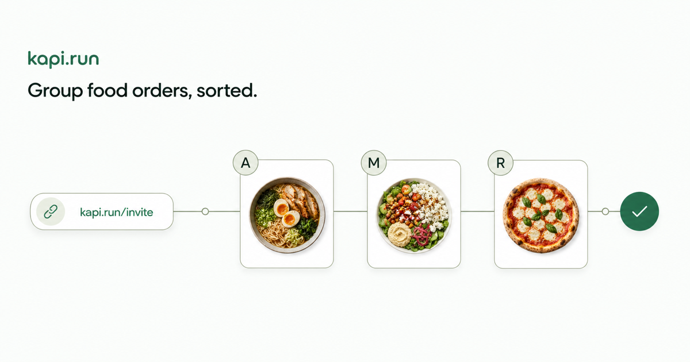

# Kapi.run

Kapi.run helps a group build one Swiggy food cart. Only the organizer connects a Swiggy account.

Participants open a shared Kapi link, select food, and submit their items. The organizer reviews the combined order and syncs it to Swiggy.

Kapi does not place or pay for the final order. The organizer completes checkout in Swiggy.



## Why this version is different

The original version scraped private Swiggy APIs. Swiggy later blocked those requests.

The original version also used hard-coded restaurant IDs. It requested a location to find the nearest outlet for a restaurant chain.

The current version uses Swiggy OAuth and MCP tools:

- The organizer connects a Swiggy account through OAuth.
- Kapi loads saved delivery addresses from the connected account.
- Kapi searches current restaurants for the selected address.
- Restaurant IDs come from current Swiggy search results.
- Menus, customizations, availability, and cart data come from Swiggy MCP.
- Participants do not need a Swiggy account.

This design removes the blocked scraping path. Restaurant or outlet changes do not require source-code changes.

## Group-order flow

1. The organizer connects a Swiggy account.
2. The organizer selects a saved address and a restaurant.
3. The organizer sets an order cutoff and creates a Kapi session.
4. Participants open the shared link and build personal draft carts.
5. Participants submit their items to the encrypted group session.
6. The organizer reviews the combined order and locks the session.
7. Kapi syncs the available items to the organizer's Swiggy cart.
8. The organizer reviews, pays, and places the order in Swiggy.

## Architecture

The repository uses Bun workspaces.

- `apps/web` contains the React and Vite web app.
- `apps/api` contains the Elysia API, Swiggy OAuth proxy, MCP client, and session relay.
- `apps/landing` contains the standalone Astro landing site.
- `packages/spec` contains the shared TypeScript contracts.

The browser app connects to the API through a configured base URL. Each deployment can choose its own host and proxy layout.

## Session and privacy model

- Participant draft carts stay in the participant's browser until submission.
- The browser encrypts shared group data before it sends the data to the relay.
- Session links contain the information that participants need to join the session.
- The API stores the Swiggy OAuth token in the configured data directory.
- Swiggy keeps payment details and final checkout data.
- Kapi does not use order data for advertising or participant profiles.

## Local development

Install Bun before you start.

Install the workspace dependencies:

```sh
bun install
```

Start all workspace apps:

```sh
bun run dev
```

Start only the web app and API in separate terminals:

```sh
bun run dev:web
bun run dev:api
```

The web app uses `http://127.0.0.1:3000` by default. The API uses `http://127.0.0.1:3001` by default.

## Commands

Run these commands from the repository root:

| Command               | Purpose                          |
| --------------------- | -------------------------------- |
| `bun run dev`         | Start all workspace apps.        |
| `bun run dev:web`     | Start the web app.               |
| `bun run dev:api`     | Start the API.                   |
| `bun run dev:landing` | Start the landing site.          |
| `bun run build`       | Build the web app.               |
| `bun run check`       | Check formatting and TypeScript. |
| `bun run lint`        | Run the web linter.              |
| `bun run test`        | Run the web tests.               |

## Deployment

The repository includes Dockerfiles and a Compose file for container deployments.

Configure the public web URL, API URL, OAuth redirect URL, and persistent data directory for your environment.

Keep OAuth tokens and session data out of source control. Store API data on persistent storage.

Read [docs/deployment.md](docs/deployment.md) for the required environment variables and deployment requirements.

## Product scope

Kapi syncs a group cart to Swiggy. It does not apply coupons, select payment methods, or place orders.

Read [docs/v0-product-spec.md](docs/v0-product-spec.md) before you change product behavior.
